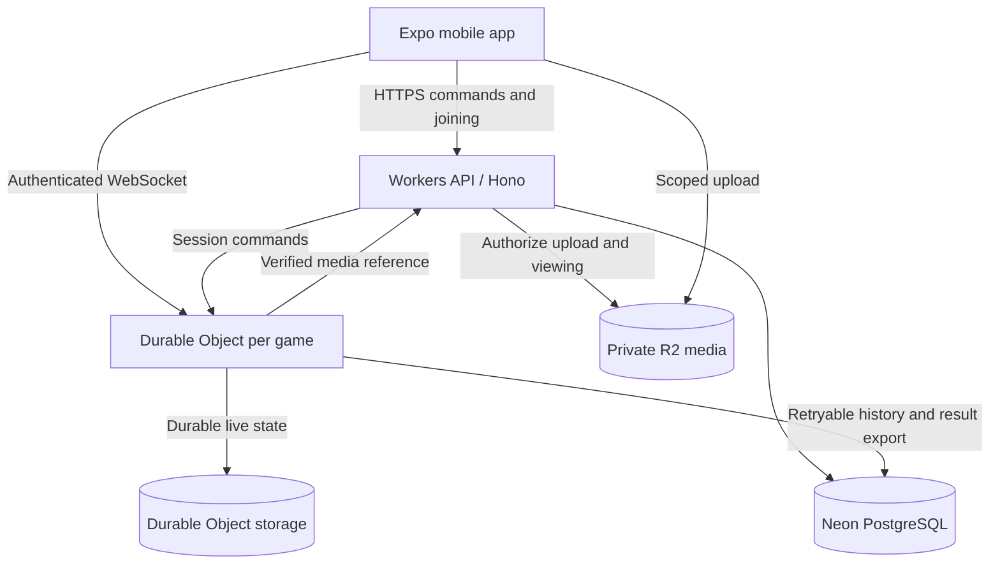

# Architecture

**Status:** Proposed architecture for the Manhunt MVP. No infrastructure is implemented yet.

## Goals

Support one authoritative game coordinator per session, fast joining, privacy-filtered realtime updates, durable recovery, and a clean separation between rules and platform code. Design for 4–20 players before optimizing for large public games.

## System boundaries

The diagram describes responsibilities, not finalized endpoints or provider integration details.

### Mobile application

Expo, React Native, TypeScript, and Expo Router provide the proposed app foundation. Device adapters handle location, camera, notifications, secure credentials, and local caching. Choose MapLibre or Mapbox after testing native support, licensing, outdoor readability, and offline behavior.

The mobile app submits intentions and renders recipient-specific state. It never calculates a final capture, winner, or unauthorized enemy position independently.

### API service

Cloudflare Workers with Hono and Zod handles identity, create/join requests, code lookup, media authorization, historical results, and connection authorization. All session mutations route through that session's coordinator; the API must not independently modify live gameplay tables.

Authentication must support guest identities. Better Auth is proposed for permanent accounts; guest session membership and recovery need an explicit credential design before implementation.

### Live game coordinator

One Durable Object owns each session's serialized commands, authoritative state, location observations, scheduled transitions, captures, recipient projections, and realtime connections.

Use a stable internal session ID for coordinator identity. A short code such as `J7K4P` is a discoverable alias, not a secret or permanent identity. Code generation and lookup must handle collisions and expiry.

Durable state survives restarts. WebSocket connections and process memory are not the sole copies of state. Scheduling must reconcile against persisted deadlines after recovery.

### Persistence

Neon PostgreSQL with Drizzle stores identities, versioned definitions, session summaries, memberships, capture metadata, retained events, and final results. Durable Object storage is the authority for live transitions.

Proposed consistency model: commit live state and a durable export record together, then retry PostgreSQL export idempotently. A temporary database outage must not invalidate a capture already committed by the coordinator. Database summaries may lag; live clients read the coordinator. This pattern needs a provider compatibility spike before implementation.

### Media

Private R2 objects store capture photos. API-authorized uploads are bounded by session, actor, purpose, size, and expiry. Clients submit a media reference; the server verifies ownership and upload completion before using it as evidence. Storage keys are never sufficient authorization to view evidence.

## Proposed repository structure

| Path | Responsibility |
| --- | --- |
| `apps/mobile` | Screens, routing, device capabilities, local cache |
| `services/api` | HTTP routes, coordinator adapter, WebSocket protocol, deployment |
| `packages/contracts` | Validated transport schemas, protocol versions, public projections |
| `packages/game-engine` | Platform-independent transitions and rules |
| `packages/game-presets` | Versioned Manhunt definition |
| `packages/location` | Pure geometry and quality assessment |
| `packages/db` | Schema, migrations, persistent queries |
| `packages/api-client` | Typed transport, reconnection, command receipts |
| `packages/auth` | Identity and credential integration |
| `packages/ui` | Shared mobile presentation components when needed |
| `packages/config` | Shared TypeScript and tooling configuration |
| `packages/utils` | Only genuinely shared utilities with clear ownership |

Use pnpm and Turborepo when application code is introduced. Avoid creating unused packages simply to match this tree.

## Dependency rules

- The engine may depend on pure domain and geometry types, never React Native, Cloudflare, PostgreSQL, camera APIs, or WebSockets.
- Transport schemas must distinguish internal state from public views.
- Presets compose engine primitives; they do not introduce provider-specific behavior.
- Mobile code cannot import database or private coordinator modules.
- External side effects belong in adapters around the engine.

## Operational requirements

Maintain separate development and production environments, secret bindings, schema migrations, and private media buckets. Record command failures, coordinator recovery, projection delivery delays, export retries, and failed uploads without logging raw credentials or precise locations.

Verification should include engine invariants, projection privacy, coordinator restart recovery, two-device synchronization, and physical field play. See [current phase](current-phase.md) for sequencing and [security](security.md) for trust boundaries.
