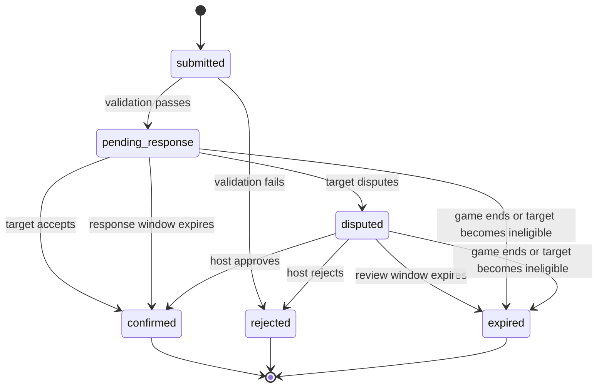

# Capture and disputes

**Status:** Pure capture lifecycle implemented: validated submission, acceptance/dispute, host review, automatic confirmation/expiry, elimination, and hunter victory. Numeric confirmation deadlines and GPS thresholds remain configurable open decisions. Private uploads, recipient projections, and durable scheduling are not implemented.

## Player flow

1. An active hunter selects Capture during the hunting phase.
2. The app explains location quality/connectivity problems before proceeding.
3. The hunter takes a photo and selects an eligible runner.
4. The photo uploads through a private, scoped upload authorization.
5. The hunter submits an attempt with a unique command ID and evidence reference.
6. The coordinator validates the attempt using server-held observations.
7. The target accepts or disputes an eligible attempt.
8. A final decision determines elimination and capture credit.

No automatic image recognition is included. Photo evidence supports friendly confirmation and host review; the app must not claim to recognize the target.

## Server validation

Check authenticated membership, active phase, hunter capability, non-self eligible runner, evidence ownership and completed upload, acceptable timestamp/sample freshness, bounded GPS accuracy, capture distance policy, target state, and command uniqueness.

The server computes distance. The hunter cannot supply authoritative target coordinates, actor identity, capture validity, or elimination state. Hidden target GPS used for validation is not returned to the hunter; expose an allowed distance/result summary only if the disclosure policy permits it.

## Proposed state machine

The domain implementation follows this configurable development policy: valid attempts auto-confirm after a short target-response window unless disputed; disputed attempts expire if not resolved within a bounded review window. Pending/disputed runners remain active until confirmation. The game timer never waits for a dispute.

At timer expiry, unresolved attempts expire without elimination. Process due game deadlines before response deadlines or incoming commands. A target already finally eliminated makes other unresolved attempts expire; only the first final confirmation receives credit.

If a target reconnects before the response deadline, show the pending attempt. Disconnection does not pause the deadline; make that rule explicit in lobby instructions.

## Host review

Only an authorized reviewer can resolve a disputed attempt, with a recorded decision and optional short reason. Show the relevant photo and validation summary; never expose an unrestricted live map.

Host participation creates a potential conflict of interest. The first friendly-game proposal permits host resolution and records it visibly. Decide whether a second designated reviewer is needed before wider release.

Changing host privileges must not silently change team or role. Repeated/reordered review commands cannot reverse a final result.

## Evidence lifecycle

Allocate an asset ID before upload, enforce size/type/expiry limits, verify the object, and bind it to the correct actor and session. Restrict viewing to the hunter, target, and authorized reviewer while required.

Expire unused uploads and delete unreferenced objects. Store final capture outcomes separately from sensitive photo/location evidence so evidence can be deleted without destroying aggregate results.

## Failure behavior

Use specific rejection reasons: wrong phase, target unavailable, missing photo, failed upload, stale GPS, poor GPS, ambiguous distance, out of range, expired attempt, or permission denied.

Retry a lost submission acknowledgement with the same command ID. Do not turn a failed upload or a local camera shutter into a successful capture.

See [game engine](game-engine.md), [location](location.md), and [privacy](privacy.md) for shared invariants.
