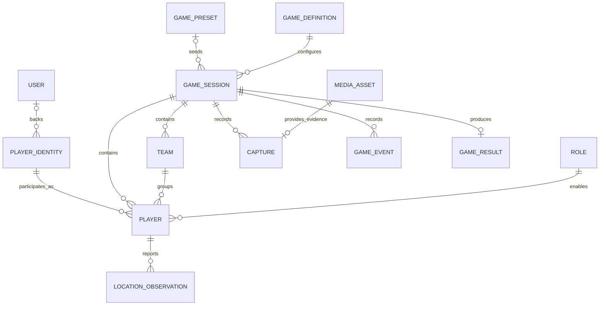

# Data model

**Status:** Logical model and proposed persistence design. This is not a committed database schema.

## Domain vocabulary

| Entity | Identity and responsibility |
| --- | --- |
| User | Permanent account; optional for participating |
| PlayerIdentity | Guest or account-backed identity, independent of any one game |
| GameDefinition | Versioned validated rules |
| GamePreset | Named reusable source of a definition |
| GameSession | One lobby/game instance and locked configuration |
| Player | One identity's membership in a session |
| Team | Session allegiance derived from definition |
| Role | Definition capability set assigned within a session |
| LocationObservation | Quality-bearing sample associated with a player |
| Zone | Geographic area and permitted effects |
| Objective | Completion/ownership condition |
| Capture | Attempt, evidence, validation, and adjudication |
| MediaAsset | Private uploaded object and ownership metadata |
| GameEvent | Ordered record of a domain occurrence |
| GameResult | Immutable terminal outcome |

`PlayerIdentity` and `Player` are distinct: the same identity can participate in multiple sessions. A guest identity does not require a `User` row.

## Relationships

Roles are versioned definition entries; the diagram does not require a standalone SQL role table. Captures reference both a hunter player and a target player in the same session.

## Proposed entity fields

### Identity

`User`: ID, authentication subject, created timestamp, account lifecycle metadata. Authentication-sensitive fields belong to the chosen auth integration.

`PlayerIdentity`: ID, optional user ID, display name, created timestamp, guest expiry. Store recoverable guest credentials separately as revocable credential records; never expose raw credentials through player views.

### Definition and preset

`GameDefinition`: ID, schema version, definition version, validated configuration, creation timestamp. Units must be explicit (`durationSeconds`, `captureRadiusMeters`, etc.).

`GamePreset`: ID, stable key, name, description, current definition version. Existing sessions retain their own snapshot when a preset changes.

### Session

`GameSession`: ID, join code, host player ID, optional preset reference, definition snapshot/version, status, created timestamp, release/deadline timestamps, terminal reason, latest state version, retention deadline.

The join-code index enforces uniqueness among joinable sessions. Use random non-sequential codes; decide case normalization and ambiguous-character exclusions before implementation. Do not use codes as credentials.

### Player, team, and role

`Player`: ID, session ID, identity ID, session display name, team key, role key, readiness, participation status, gameplay status, joined/left timestamps, eliminated timestamp, elimination reason.

Enforce one membership per identity/session and same-session references. Connection presence and last observed device health are live state, not substitutes for gameplay status. Session names can be frozen independently of future profile-name changes.

`Team`: session ID, team key, label. `Role`: definition version, role key, validated capabilities. The MVP can derive both from the configuration instead of introducing unnecessary tables.

### Location observation

Fields: player/session IDs, latitude, longitude, accuracy meters, observed timestamp, server receipt timestamp, sample sequence, and validation status/reason.

Keep the latest acceptable observations and only a short bounded buffer if capture assessment requires it. Do not write an indefinite movement trail to PostgreSQL. Visibility projections are derived outputs with their own expiry.

### Capture

Fields: ID, session ID, hunter player ID, target player ID, command ID, evidence asset ID, server attempt timestamp, status, validation reason, measured distance, location sample references/quality, response deadline, reviewer, resolution timestamp/reason.

Raw coordinate evidence has a shorter retention lifetime than the final capture outcome. A result can retain who captured whom without retaining the exact place.

### Media asset

Fields: ID, uploader identity/player ID, session ID, purpose, private object key, upload status, verified content type/size, created timestamp, deletion deadline. An object key is an internal implementation field.

### Event

Fields: event ID, session ID, sequence, schema version, event type, server timestamp, optional actor/command ID, validated payload. Unique `(sessionId, sequence)` and event IDs support ordered idempotent export.

Avoid embedding full raw GPS and media access URLs in long-lived events. Immutable events can reference short-lived sensitive records that expire independently.

### Result

Fields: session ID, terminal event ID, outcome (`completed` or `cancelled`), winning team when applicable, start/end timestamps, per-player survival outcome, confirmed capture counts, definition version. Unique session ID prevents multiple results.

Distance travelled, closest escape, and replay are future data products, not MVP fields to collect speculatively.

## Storage ownership

| Data | Authority | Persistent copy |
| --- | --- | --- |
| Guest/account identity | Identity/API layer | PostgreSQL/auth storage |
| Live roster and configuration | Session coordinator | Durable Object storage; SQL summary |
| Timers and gameplay state | Session coordinator | Durable Object storage |
| Recent precise GPS | Session coordinator | Short-lived bounded records |
| Captures and domain events | Session coordinator | Durable state plus idempotent SQL export |
| Photos | Private R2 | Metadata in durable state/SQL as needed |
| Results | Coordinator final transition | Durable result plus SQL export |

There is no cross-provider transaction spanning Durable Object storage, PostgreSQL, and R2. Use explicit intermediate states, durable export queues, retries, uniqueness constraints, and orphan-media cleanup.

## Deferred entities

Zones, objectives, scoring rules, respawns, saved community definitions, and published templates remain documented domain concepts. Add tables and contracts only when the corresponding feature is in scope.

See [privacy.md](privacy.md) for retention decisions and [realtime.md](realtime.md) for public state projections.
