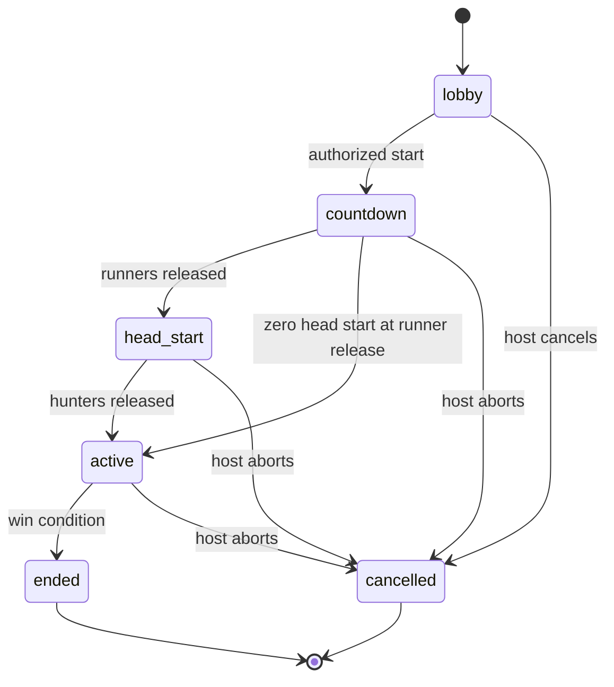

# Game engine

**Status:** Proposed domain behavior for the MVP. Interfaces below illustrate responsibilities rather than finalized code contracts.

## Responsibility

The engine evaluates commands against a versioned definition and current state, produces domain events and a new state, and evaluates win conditions. It is independent of UI, databases, network transport, clocks, and device APIs.

```ts
type TransitionResult =
  | { accepted: true; state: GameState; events: GameEvent[]; effects: Effect[] }
  | { accepted: false; reason: CommandRejection };

// The adapter supplies authenticated identity, authoritative time,
// validated observations, and verified evidence references.
function transition(
  definition: GameDefinition,
  state: GameState,
  command: AuthorizedCommand,
  context: TransitionContext,
): TransitionResult;
```

Inject time and generated identifiers to make the same inputs produce the same transition. Adapters execute effects only after the durable transition is committed.

## Definition

Persist a versioned, immutable definition snapshot per session. Lobby settings may change through authorized commands; starting locks the gameplay configuration.

Definitions describe duration with explicit units, player limits, teams, roles, play area, location visibility, capture requirements/consequences, respawn policy, scoring, zones, objectives, and win conditions. MVP supports the subset needed for Manhunt. Reject unsupported rule variants rather than silently ignoring them.

Teams define allegiance; roles define capabilities. Do not infer authority from a displayed team label.

Use declarative validated data, not uploaded JavaScript or arbitrary user code, for future custom definitions.

## Session lifecycle



`countdown` is a short shared preparation period. At runner release, a positive head start begins. With zero head start, the hunt begins immediately. Hunters cannot capture during countdown or head start.

Pause/resume is a future primitive, not part of the first release. Host abort is distinct from a competitively won game.

## Player state

Keep participation (`joined`, `left`), connection (`connected`, `disconnected`), readiness, and gameplay status (`active`, `eliminated`) distinct. Connection loss is not elimination. Host is an authorization relationship, not a gameplay role.

MVP late joining is disabled after start. A previously joined player can reconnect. An active runner remains eligible for capture when disconnected only if server observations meet the capture policy; missing GPS cannot be treated as proof of proximity.

Implemented local departure policy: explicit active-game leave is a forfeit; temporary disconnect is separate. All hunters forfeiting cancels. Host departure transfers control to the earliest remaining member. Lobby departures revoke membership and are excluded from readiness/capacity/victory checks. Departures clear private tracking and expire involved unresolved captures. Field balancing remains to be evaluated.

## Commands, actions, and events

A command is an authenticated request that may fail. A domain action is a permitted effect inside a transition. An event records an accepted occurrence.

MVP commands include create/join/leave, set readiness, assign teams/roles, update lobby settings, start/abort, submit location, attempt capture, accept/dispute capture, and resolve dispute. Due-time transitions are internal commands supplied by the coordinator.

Each command has a unique ID, actor, session, and validated payload. The coordinator derives the actor from the credential. Repeated command IDs return the existing receipt without repeating effects.

Event envelope proposal:

```ts
interface GameEvent {
  id: string;
  sessionId: string;
  sequence: number;
  type: string;
  occurredAt: string; // Server UTC timestamp
  actorPlayerId?: string;
  commandId?: string;
  schemaVersion: number;
  payload: unknown; // Validated per event type
}
```

Sequence provides ordering within a session. Public event payloads are recipient projections, never the internal event log.

## Scheduling

Proposed timestamps: preparation deadline, `runnersReleasedAt`, `huntStartsAt`, `endsAt`, and numbered reveal windows.

`endsAt = huntStartsAt + duration`. The first reveal begins at `huntStartsAt + revealInterval`; reveal N begins at `huntStartsAt + N × revealInterval`. Use half-open windows: visible at start, hidden at end. A window cannot extend past game end.

Freeze recent acceptable runner samples at reveal start rather than sending a live stream throughout the window. The adapter persists that authorized snapshot and its expiry; reconnects during a reveal receive the same snapshot, subject to elimination and membership changes.

Advance due transitions before evaluating player commands. Server receipt time controls deadlines; a phone timestamp cannot make a late action eligible. Exact timer expiration takes precedence over captures received at or after the deadline. Skipped reveals after recovery must not be replayed as fresh information.

## Capture and win evaluation

Capture validation checks phase, actor capability, eligible target, evidence, fresh location quality, distance policy, and any applicable zone restriction. See [capture.md](capture.md) for the proposed dispute state machine.

Only a final confirmed capture eliminates. Pending/disputed captures do not remove a runner or postpone the hunting deadline. At deadline, unresolved attempts expire without elimination. Commands are serialized so two hunters cannot both receive credit for eliminating the same target.

After an elimination/forfeit, evaluate whether all runners are eliminated. At the deadline, surviving runners win. The first committed terminal transition produces one immutable result; later commands cannot change it.

## Core invariants

- One coordinator owns every mutable session transition.
- A player belongs to one session and has valid team/role references.
- Starting requires valid roster, readiness, and configuration.
- Eliminated players cannot perform capture actions.
- Pending captures cannot cause final elimination.
- A target is eliminated at most once in Manhunt.
- No reveal survives its expiry or the session ending.
- One session produces at most one competitive final result.
- No hidden location is included in an unauthorized projection.

## Verification approach

Test valid/invalid transitions, deadline boundaries, simultaneous capture order, repeated command IDs, GPS ambiguity, reveal filtering, unresolved disputes at game end, and terminal-state immutability. Future modes should prove shared primitives through new presets, rather than extending a growing set of mode-specific conditionals.
